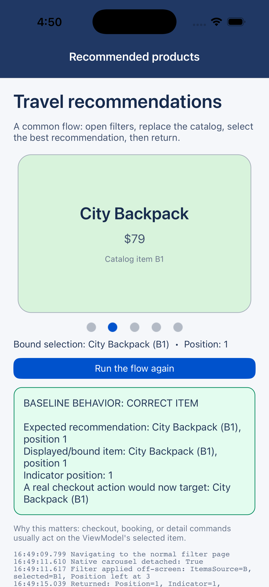
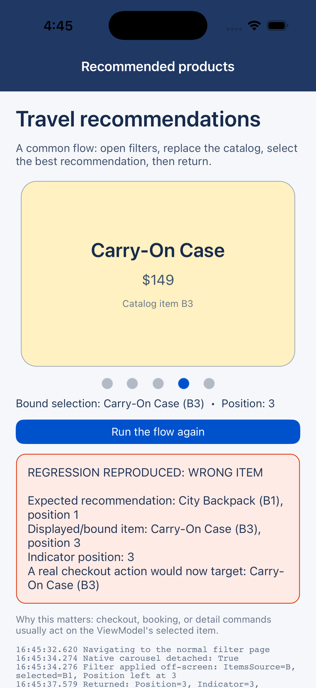

# CarouselView detached refresh selection repro

This iOS-only app models a normal storefront flow:

1. A product carousel is displaying the fourth item in catalog A.
2. The user opens a filter page, detaching the product page's native carousel.
3. An asynchronous refresh replaces the shared ViewModel's `ItemsSource` with catalog B.
4. The ViewModel selects its recommended item, B1, through the two-way `CurrentItem` binding.
5. The app returns without directly changing `Position`; CarouselView is responsible for synchronizing its two public selection APIs.

The project explicitly registers `CarouselViewHandler2`, uses `Loop=false` and disables scroll animation. The trigger uses only public MAUI properties and ordinary `NavigationPage` navigation. A native `UIView.Window == null` check is diagnostic only: the run is considered valid only after it confirms that the carousel really detached before the ViewModel refresh.

## Proven differential

| Revision | Observed final state |
| --- | --- |
| Parent `46c5a6e2e37c155dad41dc0c72d04fccda289923` | Position/Indicator 1; CarouselView and ViewModel select B1 (`City Backpack`) |
| Affected `168830f443380ebd412b002277a21cffeeee6670` | Position/Indicator 3; CarouselView overwrites the ViewModel selection with B3 (`Carry-On Case`) |

The affected behavior demonstrates concrete app impact: a checkout, booking, details, or command surface bound to `SelectedProduct` silently acts on a different item than the app selected during the refresh.

### iOS simulator evidence

The same project directory was copied byte-for-byte into worktrees at the two revisions and run on the same simulator on July 15, 2026:

- Xcode 26.4 (`17E192`)
- iOS 26.4 simulator runtime (`23E244`)
- iPhone 17 Pro, arm64
- .NET SDK 10.0.203 and iOS workload 26.4.10259

| Exact parent: correct B1 | Affected commit: wrong B3 |
| --- | --- |
|  |  |

Machine-readable results:

- [Parent `BASELINE_PASS`](Evidence/parent-46c5a6e2e3-result.txt)
- [Affected `REGRESSION_REPRODUCED`](Evidence/affected-168830f443-result.txt)

Both results record `initial_state_ready=True`, `native_carousel_detached=True`, and `error=none`. The only framework difference in the A/B run is commit `168830f443`.

The harness emits `REGRESSION_REPRODUCED` only for the exact affected signature: a valid detached run expecting B1 that returns with CarouselView, IndicatorView, and the two-way bound ViewModel all at B3/position 3. Any other mismatch is `INCONCLUSIVE`; navigation or harness exceptions are `HARNESS_ERROR`.

## Build

From the repository root:

```bash
dotnet build src/Controls/src/Build.Tasks/Controls.Build.Tasks.csproj \
  -c Debug -f netstandard2.0
dotnet build src/SingleProject/Resizetizer/src/Resizetizer.csproj \
  -c Debug -f netstandard2.0
dotnet build src/Controls/samples/CarouselViewDetachedRefreshRepro/CarouselViewDetachedRefreshRepro.csproj \
  -f net10.0-ios -c Debug -r iossimulator-arm64
```

The app bundle is written under:

```text
artifacts/bin/CarouselViewDetachedRefreshRepro/Debug/net10.0-ios/iossimulator-arm64/
```

## Simulator autorun

Install the generated `.app`, then launch with:

```bash
SIMCTL_CHILD_CAROUSEL_REPRO_AUTORUN=1 \
SIMCTL_CHILD_CAROUSEL_REPRO_BUILD_LABEL=affected-168830f443 \
xcrun simctl launch --terminate-running-process booted \
  com.adamessenmacher.maui.carouselrefreshrepro
```

The final screen is green for the parent behavior and red when the regression is reproduced. A machine-readable `carousel-repro-result.txt` is written to `FileSystem.AppDataDirectory` and the app prints a `CAROUSEL_REPRO_RESULT|...` marker to the simulator log.

## Why the affected commit fails

While the carousel is detached, `InitialPositionSet` is false. Replacing `ItemsSource` therefore leaves the old public `Position` at 3, but the affected controller unconditionally records `_lastSyncedPosition = 0`. On reattach it treats `3 != 0` as proof that Position was intentionally changed while detached, ignores the valid B1 `CurrentItem`, scrolls to B3, and writes B3 back through the two-way binding.

The parent simply resolves the valid `CurrentItem` in the replacement source and restores its actual index, 1.
