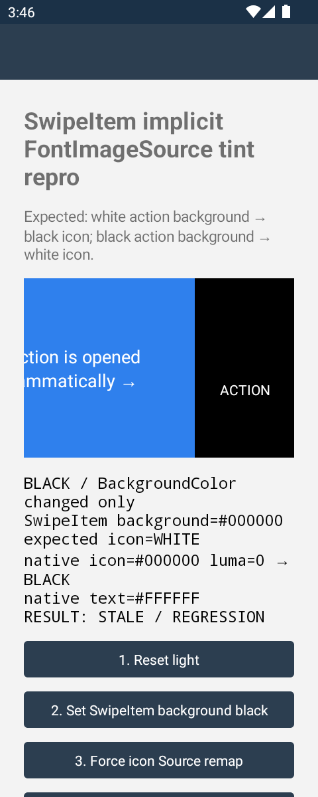
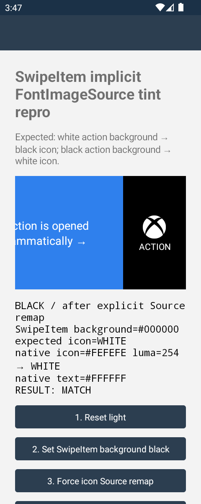
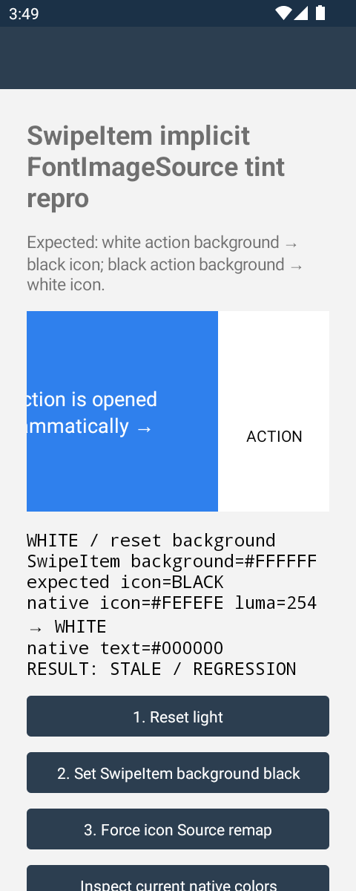

# Android SwipeItem implicit FontImageSource tint regression

This branch is based on `dotnet/maui` inflight merge commit
`d31bd4e615c81445ea355c70c1eae2b25f1d7149` from
[PR #36271](https://github.com/dotnet/maui/pull/36271).

It reproduces an Android regression where changing the background of an
already-attached `SwipeItem` updates the native background and text color but
leaves an implicit-color `FontImageSource` drawable with its old tint.

The missing dependent tint refresh was identified during PR review in
[discussion_r3573537570](https://github.com/dotnet/maui/pull/36271#discussion_r3573537570).

## Result

| State | Background | Native text | Native icon | Result |
| --- | --- | --- | --- | --- |
| Initial | `#FFFFFF` | `#000000` | `#000000`, luma 0 | Match |
| `BackgroundColor` changed only | `#000000` | `#FFFFFF` | `#000000`, luma 0 | **Stale / regression** |
| Explicit Source remap | `#000000` | `#FFFFFF` | `#FEFEFE`, luma 254 | Match |

The black icon is effectively invisible on the black action background.
Resetting the background after the control step reproduces the inverse failure:
the white icon remains stale on a white background.

The app measures the actual native Android compound drawable rather than
inferring its color from a screenshot. It renders the drawable into a 96x96
transparent bitmap and computes an alpha-weighted RGB/luminance value.

## Build and run

From the repository root:

```bash
./build.sh -restore
dotnet build Microsoft.Maui.BuildTasks.slnf -v:minimal

dotnet build src/Controls/samples/Controls.Sample.Sandbox/Maui.Controls.Sample.Sandbox.csproj \
  -f net10.0-android \
  -p:RuntimeIdentifier=android-arm64 \
  -p:EmbedAssembliesIntoApk=true \
  --no-restore -v:minimal

adb install -r \
  artifacts/bin/Maui.Controls.Sample.Sandbox/Debug/net10.0-android/android-arm64/com.microsoft.maui.sandbox-Signed.apk

adb shell am start -W -n com.microsoft.maui.sandbox/.MainActivity
```

On a short emulator, temporarily use `adb shell wm size 480x1200` so every
control is visible without scrolling. Restore it afterward with
`adb shell wm size reset`.

## Reproduce

1. Wait for the app to open the action automatically.
2. Confirm the initial status says `RESULT: MATCH`.
3. Without scrolling, closing, or reopening the action, tap
   **2. Set SwipeItem background black**.
4. The report changes to `RESULT: STALE / REGRESSION`; the icon is black on
   black even though the native text has changed to white.
5. Tap **3. Force icon Source remap**. The same drawable becomes white and the
   report changes to `RESULT: MATCH`.

Keeping the action attached is important. Closing/reopening or reattaching it
can call `UpdateSize()`, which incidentally reapplies Source and masks the bug.
A full `UserAppTheme` switch also remapped Source in testing, so the confirmed
trigger is a background-only change while the native action remains attached.

## Captured evidence

### Background changed, drawable tint stale



### Explicit Source remap control



### Reverse direction



## Cause

PR #36271 adds a `SwipeItem.BackgroundColorProperty` callback that remaps only
`ISwipeItemMenuItem.Background`. Android `MapBackground` updates the native
background and text color, but the implicit font-icon tint is applied from
`item.GetTextColor()` only inside the Source setter. Because Source is not
invalidated, an existing drawable keeps its previous contrast tint.

The Issue31917 test added by #36271 has no `IconImageSource`, so it verifies the
background update without exercising this dependent icon state.

## Environment used

- Android 13 / API 33
- arm64 `Maui_Tiny_API33` emulator
- `net10.0-android`
- In-tree build tasks and APK build completed successfully
